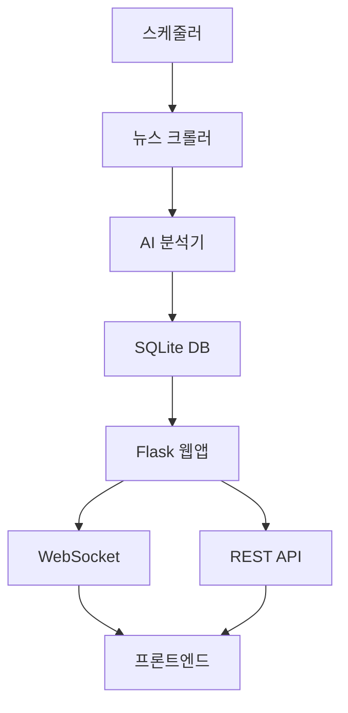

# 🚀 반도체 뉴스 애그리게이터 - semiconductor-news

Notion 스타일의 웹 기반 반도체 관련 뉴스 크롤링 및 요약 서비스

## ✨ 주요 기능

### 📰 스마트 뉴스 수집
- **10개 주요 반도체 뉴스 소스** 실시간 모니터링
- AI 기반 **중요도 자동 분석** 및 우선순위 설정
- **키워드 필터링**으로 관련성 높은 기사만 수집
- **중복 제거** 로직으로 깨끗한 뉴스 피드

### 🤖 AI 요약 및 분석
- **OpenAI GPT** 기반 스마트 요약
- **핵심 키워드** 자동 추출
- **중요도 점수** 및 **카테고리** 자동 분류
- 반도체 산업 특화 **컨텍스트 이해**

### 🎨 Notion 스타일 UI
- **깔끔하고 직관적인** 인터페이스
- **다크/라이트 모드** 자동 감지
- **반응형 디자인** (모바일 최적화)
- **실시간 업데이트** 및 알림

### 🔧 개인화 기능
- **사용자 선호도 설정** (관심 분야, 알림 주기)
- **북마크 시스템** (중요 기사 저장 및 메모)
- **맞춤형 뉴스 피드**
- **검색 및 필터링**

### ⚡ 실시간 기능
- **WebSocket 기반 동기 알림**
- **새 기사 자동 업데이트**
- **실시간 우선순위 변화 추적**
- **브라우저 알림 지원**

## 🏗️ 시스템 아키텍처



### 🔧 기술 스택
- **Backend**: Python 3.10, Flask, SQLAlchemy
- **Frontend**: HTML5, CSS3, Vanilla JavaScript
- **Database**: SQLite (개발), PostgreSQL (프로덕션)
- **AI**: OpenAI GPT API
- **실시간**: Flask-SocketIO, WebSocket
- **크롤링**: BeautifulSoup4, Selenium
- **컨테이너**: Docker, Docker Compose

## 📚 뉴스 소스 (10개)

1. **EE Times** - 전자공학 전문
2. **AnandTech** - 하드웨어 리뷰
3. **Tom's Hardware** - 테크 뉴스
4. **Semiconductor Engineering** - 반도체 기술
5. **EE News** - 산업 뉴스
6. **SemiMedia** - 반도체 산업 분석
7. **Electronics Weekly** - 전자 산업
8. **EDN Network** - 설계 엔지니어링
9. **Electronics360** - 글로벌 전자산업
10. **All About Circuits** - 회로 설계

## 🚀 설치 및 실행

### 1. 직접 실행
```bash
# 저장소 클론
git clone <repository-url>
cd semiconductor-news

# 가상 환경 설정
python -m venv venv
source venv/bin/activate  # Windows: venv\Scripts\activate

# 의존성 설치
pip install -r requirements.txt

# 환경 변수 설정
cp .env.example .env
# .env 파일에서 OPENAI_API_KEY 설정

# 데이터베이스 초기화 및 샘플 데이터
python main_run.py --update

# 웹 서버 실행
python main_run.py --web
```

### 2. Docker 실행
```bash
# Docker Compose 실행
docker-compose up -d

# 개발 환경
docker-compose --profile dev up -d
```

### 3. 접속
- **웹 대시보드**: http://localhost:5000
- **사용자 설정**: http://localhost:5000/preferences
- **API 문서**: http://localhost:5000/api/articles

## ⚙️ 사용 방법

### 📱 웹 대시보드
1. **홈**: 우선순위별 뉴스 피드
2. **검색**: 키워드로 기사 검색
3. **북마크**: 중요 기사 저장
4. **설정**: 개인 선호도 맞춤 설정

### 🔧 CLI 명령어
```bash
# 뉴스 업데이트
python main_run.py --update

# 웹 서버 실행 
python main_run.py --web

# 백그라운드 스케줄러
python main_run.py --scheduler
```

### 📡 API 엔드포인트
- `GET /api/articles` - 기사 목록
- `POST /api/bookmarks` - 북마크 추가
- `GET /api/preferences` - 사용자 설정
- `GET /health` - 헬스 체크

## 🌍 클라우드 배포

### AWS ECS (추천)
```bash
# ECS 배포
./deploy/scripts/deploy-aws.sh
```

### Google Cloud Run
```bash
# Cloud Run 배포  
./deploy/scripts/deploy-gcp.sh
```

### Azure Container Instances
```bash
# ARM 템플릿 배포
az deployment group create \
  --resource-group semiconductor-news \
  --template-file deploy/azure/container-instance.json
```

### Digital Ocean App Platform
```bash
# App Platform 설정 파일 사용
# .do/app.yaml 참조
```

## 📊 기능 상세

### 🎯 AI 분석 기능
- **중요도 스코어링**: 1-10점 자동 점수 부여
- **카테고리 분류**: 제조, 설계, 시장, 기술 등
- **키워드 추출**: 핵심 기술/회사명 자동 추출
- **요약 생성**: 3-4문장으로 핵심 내용 압축

### 🔔 알림 시스템
- **실시간 WebSocket 알림**
- **우선순위별 알림 필터링**
- **브라우저 푸시 알림**
- **설정 가능한 알림 주기**

### 📱 모바일 최적화
- **반응형 사이드바** (스와이프 제스처)
- **터치 최적화 UI** (44px 타겟)
- **다크 모드** 자동 감지
- **고해상도 디스플레이** 지원

### 💾 데이터 관리
- **자동 중복 제거**
- **오래된 기사 정리**
- **사용자 데이터 백업**
- **설정 내보내기/가져오기**

## 🔧 설정 옵션

### 환경 변수
```bash
# 필수
OPENAI_API_KEY=sk-...        # OpenAI API 키
FLASK_ENV=production         # 환경 설정

# 선택적  
DATABASE_URL=postgresql://   # PostgreSQL 연결
REDIS_URL=redis://          # Redis 캐시
```

### 사용자 설정
- **관심 분야**: 세부 기술 영역 선택
- **알림 설정**: 빈도 및 중요도 임계값
- **표시 옵션**: 기사 수, 정렬 방식
- **언어 설정**: 요약 및 UI 언어

## 🛠️ 개발자 가이드

### 프로젝트 구조
```
semiconductor-news/
├── main_run.py           # 메인 실행 파일
├── web_app.py           # Flask 웹 애플리케이션
├── news_crawler.py      # 뉴스 크롤링 모듈
├── news_analyzer.py     # AI 분석 모듈
├── database.py          # 데이터베이스 모델
├── config.py           # 설정 관리
├── templates/          # HTML 템플릿
├── static/            # CSS/JS 파일
├── deploy/           # 배포 설정 파일들
└── requirements.txt   # Python 의존성
```

### 확장 포인트
- **새 뉴스 소스 추가**: `news_crawler.py` 수정
- **AI 모델 변경**: `news_analyzer.py` 수정  
- **UI 커스터마이징**: `templates/` 및 `static/` 수정
- **API 확장**: `web_app.py`에 엔드포인트 추가

## 📈 성능 및 모니터링

### 메트릭
- **크롤링 성공률**: 각 소스별 수집률
- **AI 분석 정확도**: 사용자 피드백 기반
- **응답 시간**: API/웹 페이지 로딩 속도
- **실시간 연결 수**: WebSocket 동시 연결

### 로그 및 디버깅
- **구조화된 로깅**: JSON 형태 로그 출력
- **에러 추적**: 상세한 에러 컨텍스트
- **성능 프로파일링**: 병목점 분석
- **헬스 체크**: `/health` 엔드포인트

## 🤝 기여하기

1. Fork 및 Clone
2. 기능 브랜치 생성 (`git checkout -b feature/new-feature`)
3. 커밋 (`git commit -am 'Add new feature'`)
4. 푸시 (`git push origin feature/new-feature`)
5. Pull Request 생성

## 📝 라이선스

MIT License - 자세한 내용은 [LICENSE](LICENSE) 파일 참조

## 🙋‍♂️ 지원

- **이슈 제기**: GitHub Issues
- **문서**: [DEPLOYMENT.md](DEPLOYMENT.md) 배포 가이드
- **API 문서**: `/api/articles` 엔드포인트 참조

---

**Made with ❤️ for the Semiconductor Industry**